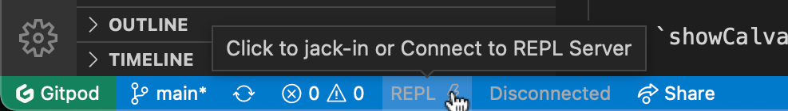
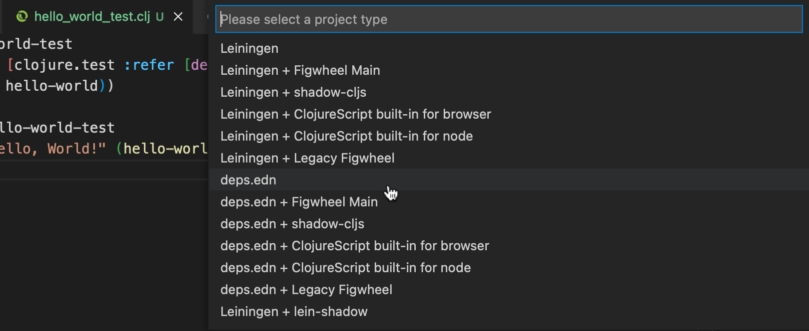
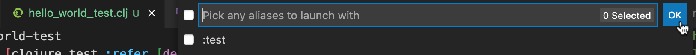

# How to use this project

Prerequistes: You should have followed the instructions in the [README](README.md) file. And be reading this in **Gitpod Code** in your browser.

This repository, when opened with Gitpod, gives you:

1. A Linux virtual machine with full root access and these things installed:
    * Java
    * The Clojure tools
    * VS Code (or Gitpod Code, actually)
    * The `exercism` command line tool
1. A workspace
    * With this file
    * Prepared for hosting your Exercism exercises
    * Gitpod Code started and this file opened

You will interact with the workspace from the VS Code integrated terminal and by editing exercise code files.

<details><summary>New to Clojure or Calva?</summary>

If you are new to Clojure or Calva (the VS Code extension used in this project) then I strongly suggest you start with checking out [Get Started With Clojure](https://calva.io/get-started-with-clojure/). It is also using [Gitpod](https://gitpod.io) to give you a zero-install introduction to using the Clojure REPL in the editor. (Plus it has a basic Clojure guide that can come in handy when working through the exercises here.)

</details><br>

## Setup

First you need to configure the `exercism` CLI tool with your Exercism API token, and make it use this workspace for the exercises.

You find your token here: https://exercism.org/settings/api_cli

Then issue this command in the integrated terminal:

```sh
exercism configure -w . -t <your token>
```

## Workflow

To work with the exercise you will for each one repeat these steps (step details below):

1. Download the exercise
1. Open the test file
1. Start the Project's Clojure REPL (Jack-in)
1. Load the test file in the REPL
1. Load the implementation file the REPL
1. Implement the solution
    1. Edit code, evaluate, edit code, evaluate, edit code, evaluate, and so on and so forth
    1. Run tests
    1. Until tests pass and you are fine with submitting the solution
1. Submit the solution
    1. Check for feedback at Exercism.org
    1. If it is a mentored exercise, you will probably get enough feedback to want to repeat from *Implement the solution*
1. Celebrate! 🎊 

### Download the excercise

You'll use the `exercism` CLI tool for this and for when submitting solutions.

The command structure for downloading an exercise looks like so:

```shell
exercism download --exercise=<excerice-slug> --track=clojure
```

You can copy the CLI command from the Exercism page, e.g. https://exercism.org/tracks/clojure/exercises/hello-world. This will copy this command:

```sh
exercism download --exercise=hello-world --track=clojure
```

Executing that will create the directory `clojure/hello-world` which contains:

1. The Clojure project file
1. A `src` directory, with the _implementation_ file `hello_world.clj` (note that the dashes in the slug are replaced with underscore when naming Clojure sourrce files)
1. A  `test` directory with the _test_ file `hello_world_test.clj`
1. Some Markdown files you can examine to get to know more about the exericise.

### Open the test file

Open `clojure/hello-world/test/hello_world_test.clj`

### Start the project REPL for the exercise (Jack-in)

With the test file open, issue the command **Start a Project REPL and Connect (aka Jack-in)**. It's avaialble from the VS Code Command Palette (`Ctrl+ALt+C Ctrl+ALt+J`) as well as via the REPL button in the statusbar.



In the Project type menu select `deps.edn`.



<details><summary>You don't see a <code>deps.edn</code> option?</summary>

If you don't see a `deps.edn` option, it is probably because you submitted a solution to the `clojure/hello-world` exercise back when it only had a Leiningen configuration. Don't worry. just select the **Leiningen** project type instead.

</details><br>

Next Calva will ask you to select an alias to start with. This is because the `deps.edn` file defines a `test` alias. Whatever you do, _don't select it!_ 😊. Just press `Enter` or click **OK**.



(Calva will actually pop up a warning about selecting the `test` alias.)

The Calva **Output/REPL Window** will open and report progress on the starting of the REPL. It is a file named `output.calva-repl`. It will later show the results of the test runs when you check if you have gotten your solution to pass its tests.

<details><summary>A note abut the Output REPL Window</summary>

This window/file is also a REPL prompt where you can evaluate Clojure code. I suggest you don't use it much for this, because all Clojure files you work with support evaluating Clojure code with the REPL.

</details><br>

### Load the test file in the REPL

Once the REPL is started, it is connected to your editor and ready to evaluate code for you. 🎉 

However, _it won't evaluate any code unless you ask it to_. To make the REPL aware of the exerice's test you need to **load** the test file. You do this by having the file active and issue the command:

**Calva: Load Current File and Dependencies**, keyboard shortcut: `Ctrl+Alt+C Enter`.

### Load the implementation file

Open `clojure/hello-world/src/hello_world.clj` (create it if it isn't there) and load it, `Ctrl+Alt+C Enter`.

### Implement the solution

This is where the fun begins! Your task is to write a solution that will make the tests of the exercise pass. Here is where you should take full advantage of Clojure Interactive Programming. Write small pieces of code and evaluate them. Rinse and repeat. Rinse and repeat again, and so on. (Maybe for `hello-world` you won't need to rinse and repeat so often, but anyway.)

Now and then you'll want to run the tests. There's a command for that:

**Calva: Run Tests for Current Namespace**, `Ctrl+Alt+C t`

Rinse and repeat!

### Submitting a solution

Once you are good with your solution you'll want to submit it. The command for this looks like so:

```sh
exercism submit <implementation_file_paths>
```

<details><summary>Tips for getting the file path</summary>

A convenient way to get the file path is to use the VS Code command **Copy Relative Path** when the file is active. Or right-click the file's tab or the filename in the Explorer pane and select **Copy Relative Path** from the pop-up menu. If you are submitting several files, use the Explorer pane to get the relative path of the `src` directory containig the solutions. Then append `/*.clj` after pasting.

</details><br>

From there it will be up to you and your mentor how many times you'll be submitting new iterations.

### Celebrate 🎉 🎊 

Learning Clojure this way is very rewarding. I hope you celebrate the steps you take adnd that you spend some time reflecting and reviwing your mentors. They deserve feedback and appreciation for all the work they are contributing to help the rest of us improve.

## See also

* [Get Started With Clojure](https://calva.io/get-started-with-clojure/) - An introduction to Clojure and to Calva (the VS Code Clojure extension this project uses).
* [Rich 4Clojure](https://github.com/PEZ/rich4clojure) - Another exercise/problem based way of learning Clojure. A very good complement to the Exercism Clojure track!

## Support my open source work ❤️

I spend a lot of time trying to make it easier to get started with, and enjoy, Clojure. The fact that I have sponsors encouraging this makes my family much more ready to accept the trade-offs I make. Please consider: https://github.com/sponsors/PEZ
