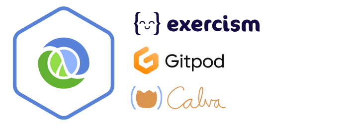

# Run the Exercism Clojure track with Full Interactive Programming in the browser

This is a [Clojure](https://clojure.org/) template configured for running the [Exercism Clojure Track](https://exercism.org/tracks/clojure) in a zero-install fashion in your browser, leveraging [Calva](https://calva.io) and [Gitpod](https://www.gitpod.io/).

## How to use

1. Copy this project by click the ”Use this Template” button.
   * Reading this from your newly created copy? Awesome. 
1. Open this link: https://gitpod.io/from-referrer/
   * This will open the repository in a Gitpod workspace in the browser.
   * _NB: If you don't have a Gitpod account, use the option to **Sign-up with GitHub**._

Using Safari?

Then the link probably won't work. Instead prepend the repository URL with `https://gitpod.io/#` and load that page.

It might take a little while, but it is well worth the wait, because in your browser you'll then have:

* A Linux virtual machine with full root access and these things installed:
    * Java
    * The Clojure tools
    * VS Code (or Gitpod Code, actually)
       * With [Calva](https://calva.io) (a Clojure extension)
    * The `exercism` command line tool
* A workspace
    * Prepared for hosting your Exercism exercises
    * Gitpod Code started and a file `INSTRUCTIONS.md` opened, which will guide you in how to download and submit [Exercism](https://exercism.orh) exercises.

## See also

* [Get Started With Clojure](https://calva.io/get-started-with-clojure/) - An introduction to Clojure and to Calva.
* [Rich 4Clojure](https://github.com/PEZ/rich4clojure) - Another exercise/problem based way of learning Clojure. A very good complement to the Exercism Clojure track!

## Contribute

Please help keeping this template useful and helpful by provding issues and pull requests.

Also, please consider sponsoring my open source work: https://github.com/sponsors/PEZ ❤️ 

## The template

Wondering where the ”Use this Template” button is? You might be reading this from a copy of the template, which is here: https://github.com/PEZ/clojure-exercism-template

## Licence

MIT

Free to use, modify and redistribute as you wish. 🍻🗽 